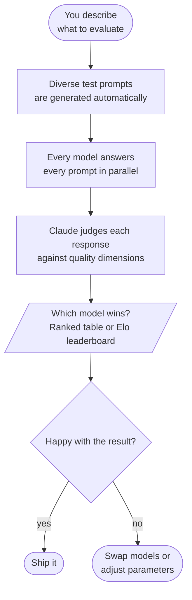
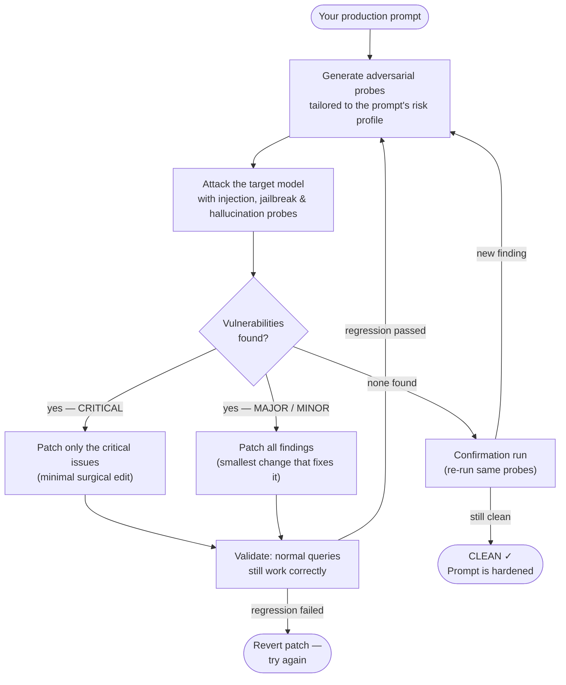

# llmeval

Compare LLM response quality across providers, judged by Claude Code.

Generates a dataset from a task description, fans it out to multiple LLM providers in parallel, then runs a structured evaluation (pointwise 1–5 or pairwise Elo) inline in your Claude Code session.

## Install

**No Go required.** The install script downloads a pre-built binary from the latest GitHub release.

```bash
# One-liner: installs binary + Claude Code slash command
bash <(curl -fsSL https://raw.githubusercontent.com/farhaan/llmeval/main/install.sh)
```

Or from the repo root (if you have it cloned):

```bash
bash install.sh
```

This does three things:

1. Downloads the pre-built `llmeval` binary for your OS/arch from the [latest GitHub release](https://github.com/farhaan/llmeval/releases/latest) and installs it to `/usr/local/bin` (or `~/.local/bin` if that isn't writable). Falls back to `go install` if no pre-built binary is available for your platform.
2. Copies `.claude/commands/llmeval.md` → `~/.claude/commands/llmeval.md` — registers the `/llmeval` slash command globally in Claude Code.
3. Registers the Claude Code plugin for the current directory (enables `/llmeval:harden` and subcommands). Requires the `claude` CLI to be on your PATH; silently skipped otherwise.

### Manual binary install

Download the binary directly from [Releases](https://github.com/farhaan/llmeval/releases/latest) — pick the archive for your platform (`darwin_arm64`, `linux_amd64`, etc.), extract it, and put the `llmeval` binary anywhere on your `PATH`.

### Installing with Go (alternative)

If you have Go installed and prefer building from source:

```bash
go install github.com/farhaan/llmeval/cmd/llmeval@latest
```

The version reported by `llmeval version` is derived automatically from the git tag.

### Adding the slash command manually

Claude Code loads slash commands from two locations:

| Location | Scope |
|---|---|
| `~/.claude/commands/<name>.md` | Global — available in every project |
| `.claude/commands/<name>.md` | Project-local — available only in this directory |

To install manually without the script:

```bash
mkdir -p ~/.claude/commands
curl -fsSL https://raw.githubusercontent.com/farhaan/llmeval/main/.claude/commands/llmeval.md \
  -o ~/.claude/commands/llmeval.md
```

After that, type `/llmeval` inside any Claude Code session to invoke it.

### Installing the Claude Code plugin manually

The plugin enables `/llmeval:harden` and other subcommands:

```bash
git clone https://github.com/farhaan/llmeval
claude plugins marketplace add ./llmeval --scope project
claude plugins install llmeval@llmeval --scope project
```

Then run `/reload-plugins` inside Claude Code to activate.

## API keys

To see all configured providers and whether their keys are set:

```bash
llmeval providers
```

```
────────────────────────────────────────────────
PROVIDER          ENV VAR                   STATUS
────────────────────────────────────────────────
anthropic         ANTHROPIC_API_KEY         set ✓
deepinfra         DEEPINFRA_API_KEY         not set ✗
groq              GROQ_API_KEY              set ✓
openai            OPENAI_API_KEY            not set ✗
openrouter        OPENROUTER_API_KEY        not set ✗
────────────────────────────────────────────────
```

The list is dynamic — it reflects whatever providers are defined in your `llmeval.yaml` plus the built-in defaults. Adding a new provider in config will show up here automatically.

### Option A — shell environment (simplest)

```bash
export GROQ_API_KEY=gsk_...
export OPENAI_API_KEY=sk-...
export ANTHROPIC_API_KEY=sk-ant-...
```

Set only the providers you intend to use.

### Option B — `.env` file (per-project)

Create a `.env` file in your project root (or in `.llmeval/.env` for finer scoping):

```dotenv
GROQ_API_KEY=gsk_...
OPENAI_API_KEY=sk-...
ANTHROPIC_API_KEY=sk-ant-...
```

`llmeval collect` auto-loads `.env` then `.llmeval/.env` at startup. Shell environment always wins — a key already set in your shell is never overridden by the file.

> **Security**: add `.env` and `.llmeval/` to your `.gitignore` so keys and cached model responses are never committed.

```gitignore
.env
.llmeval/
```

### Option C — custom env var names (via `llmeval.yaml`)

If your key is stored under a different name, override `api_key_env` in config:

```yaml
providers:
  groq:
    type: openai_compat
    base_url: https://api.groq.com/openai/v1
    api_key_env: MY_GROQ_KEY   # reads $MY_GROQ_KEY instead of $GROQ_API_KEY
```

## Quick start

```bash
# In Claude Code, run:
/llmeval --task "Explain recursion to a 10-year-old"

# With specific models:
/llmeval --task "Write a haiku about Go" \
         --models "groq/llama-3.3-70b-versatile,openai/gpt-4o,anthropic/claude-haiku-4-5"

# Pairwise Elo mode:
/llmeval --task "Review this Go code" --mode pairwise

# Use a named task from llmeval.yaml:
/llmeval --task-id explain-recursion
```

## Configuration (`llmeval.yaml`)

Copy the example and customise:

```bash
cp llmeval.example.yaml llmeval.yaml
```

Define reusable tasks, add custom providers (Ollama, LM Studio, any OpenAI-compat endpoint), or tune defaults. See `llmeval.example.yaml` for the full reference.

### Editor autocomplete (YAML schema)

`llmeval.schema.json` ships with the repo. The example yaml already has the magic comment at the top:

```yaml
# yaml-language-server: $schema=./llmeval.schema.json
```

Your `llmeval.yaml` gets the same by copying from the example. This gives you:
- Autocomplete for `type`, `mode`, `params` enum values
- Inline docs on hover
- Validation errors for unknown fields or wrong types

**VS Code**: install the [YAML extension](https://marketplace.visualstudio.com/items?itemName=redhat.vscode-yaml) — the comment is enough, no settings change needed.

**JetBrains**: recognized automatically via the comment.

**Neovim**: works via `yaml-language-server` (`yamlls`) with no extra config.

## How it works



| Step | What happens |
|---|---|
| 1 | Claude Code parses your flags and resolves task config |
| 2 | Auto-selects scoring dimensions (`clarity`, `accuracy`, etc.) unless `--params` given |
| 3 | Generates a dataset of N prompts covering different angles of the task |
| 4 | `llmeval collect` fans prompts out to all models in parallel |
| 5 | Loads and validates responses; strips formatting noise |
| 6 | Judges each response with a rubric + acceptance criteria (structured, cached) |
| 7 | Aggregates scores and prints a ranked table or Elo leaderboard |

Responses and judgments are cached in `.llmeval/` — re-running the same task is instant.

## Adding providers

Any OpenAI-compatible endpoint (Ollama, LM Studio, etc.) works out of the box:

```yaml
providers:
  ollama:
    type: openai_compat
    base_url: http://localhost:11434/v1
    # no api_key_env needed for local endpoints
```

Then use `ollama/<model-name>` in `--models`.

## Runtime files

All output lives in `.llmeval/` relative to your working directory:

```
.llmeval/
  cache/          # raw API responses, keyed by content hash
  judge_cache/    # per-(model,prompt) judgment JSONs
  history.csv     # log of every collect run
  dataset.json    # last generated dataset
  raw.json        # last collected responses
```

Add `.llmeval/` to `.gitignore`.

## Harden (`/llmeval:harden`)

Adversarial red-team loop that hardens your LLM prompts against injection, jailbreak, and hallucination. Run it inside Claude Code:

```bash
/llmeval:harden --prompt priv/prompts/checkout.md --target groq/llama-3.3-70b-versatile
/llmeval:harden --all                                    # harden every prompt in manifest
/llmeval:harden --all --resume                           # continue interrupted run
```

### How harden works

The binary handles all mechanical work (running probes, applying patches, checkpointing). Claude Code handles all AI steps (probe generation, judging, patching). No extra API key needed — Claude Code is the judge.



Each iteration runs probes → judges results → patches vulnerabilities → validates against golden queries, then loops until clean or `--max-iterations` is hit. Progress is checkpointed after every step — safe to interrupt and `--resume` at any time.

### Checkpoint layout

```
.llmeval/harden/<prompt_stem>/
  state.json          ← current iteration + status
  results.tsv         ← per-iteration progress (importable as spreadsheet)
  iter_N/
    probes.json       ← adversarial inputs generated
    raw.json          ← probe run results
    judgments.json    ← findings with severity
    patch.json        ← applied patch
    golden_raw.json   ← golden validation results
```
